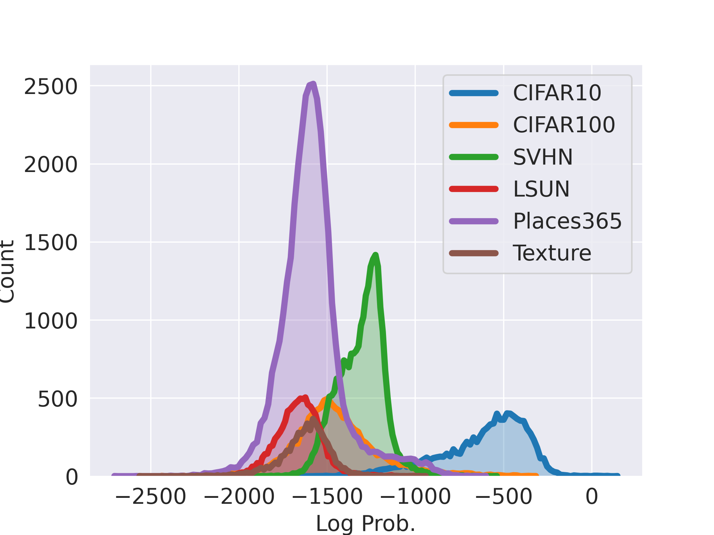
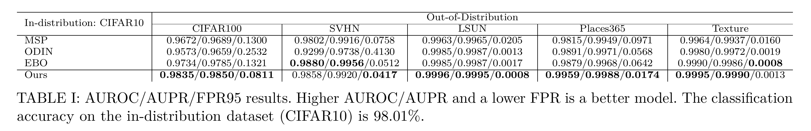

This repository implements joint joint classification and normalizing flow models for out-of-distribution detection.

MLP-mixer is used as a backbone and a normalizing flow model is attached to the penultimate layer of the classifier.
A normalizing flow model is trained on the in-distribution features and it is used as OOD scoring function at 
inference time.

# Training
The steps to train the models are 
1. Train mlp-mixer, or you can download a pretrained model from <a src=#>here</a>.
1. Fine-tune the model on in-distribution data.
1. Extract in-distribution data features of the penultimate layer of the backbone.
1. Train a normalizing flow model on the extracted features.
1. Evaluate OOD detection performance.

# Results
The results are reported on CIFAR-10 and CIFAR-100 datasets.

{ width=200 height=300 }

{ width=200 height=300 }